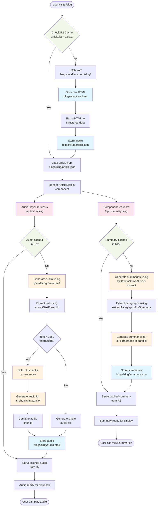

# Blog Cloudflare Listen - Backend Flow Documentation

This document explains the complete backend flow for the generic article route and how audio files and summaries are generated and stored in the R2 bucket.

## Overview

The backend follows a lazy-loading pattern where content is cached in R2 after first generation. Audio and summaries are generated **on-demand** when first requested, not during the initial page load.

## Main Components

1. **Generic Article Route** (`src/app/[...slug]/page.tsx`)
2. **Audio API Endpoint** (`src/app/api/audio/[...slug]/route.ts`)
3. **Summary API Endpoint** (`src/app/api/summary/[...slug]/route.ts`)
4. **Workers AI Integration** (`src/lib/workers-ai.ts`)
5. **Article Parser** (`src/lib/article-parser.ts`)
6. **R2 Storage** (Cloudflare Object Storage)

## Storage Structure in R2 Bucket (`blog-cloudflare-listen`)

```
blogs/
└── {slug}/
    ├── raw.html              # Original HTML from Cloudflare blog
    ├── article.json          # Parsed and structured article data
    ├── audio.mp3             # Complete audio file (created after all chunks complete)
    ├── audio-metadata.json   # Chunk tracking metadata (temporary)
    ├── audio-chunk-0.mp3     # Individual audio chunks (temporary)
    ├── audio-chunk-1.mp3     # Generated in parallel for resilience
    ├── audio-chunk-N.mp3     # ... (deleted after complete audio created)
    └── summary.json          # Generated paragraph summaries
```

**Note:** The chunked storage system is used for resilient audio generation. Individual chunks and metadata are cleaned up once the complete `audio.mp3` is successfully created.

## Detailed Backend Flow

### 1. Initial Article Request Flow

When a user visits `/{slug}`:

1. **Route Handler** (`src/app/[...slug]/page.tsx:100-163`)
    - Extracts slug from URL parameters
    - Calls `getStoredData(slug)` to check R2 cache

2. **Cache Check** (`src/app/[...slug]/page.tsx:22-53`)
    - Looks for `blogs/{slug}/article.json` in R2
    - Looks for `blogs/{slug}/summary.json` in R2
    - Returns cached data if available

3. **Fresh Article Fetch** (if not cached)
    - Fetches HTML from `https://blog.cloudflare.com/{slug}/`
    - Stores raw HTML at `blogs/{slug}/raw.html`
    - Parses article using `parseArticle()` function
    - Stores parsed data at `blogs/{slug}/article.json`
    - **Note:** Audio and summary are NOT generated at this stage

4. **Page Rendering**
    - Returns `ArticleDisplay` component with article data
    - Summary is passed as `initialSummary` if cached

### 2. Resilient Chunked Audio Generation and Storage Flow

**The system uses a sophisticated chunked approach for resilient audio generation.** Here's the complete flow:

1. **Audio Request** - AudioPlayer component loads and requests `/api/audio/{slug}`

2. **Audio API Handler** (`src/app/api/audio/[...slug]/route.ts`)
    - **Complete Audio Check First** (lines 26-44):

        ```typescript
        const audioObject = await env.BLOG_STORAGE.get(`${basePath}/audio.mp3`);
        if (audioObject) {
            // Serve complete cached audio directly
            return new NextResponse(audioBuffer, { /* headers */ });
        }
        ```

    - **Chunked Audio Status Check** (lines 47-72):

        ```typescript
        const chunkStatus = await getAudioChunkStatus(env.BLOG_STORAGE, slug);
        if (chunkStatus.isComplete && chunkStatus.availableAudio) {
            // Serve complete audio from assembled chunks
            return new NextResponse(chunkStatus.availableAudio, { /* headers */ });
        }
        ```

    - **Generate Missing Chunks** (lines 106-167):
        - Retrieves article data from `blogs/{slug}/article.json`
        - Extracts text using `extractTextForAudio(article)`
        - Calls `generateAudioResilient(textForAudio, slug)`
        - **ALWAYS attempts to regenerate missing chunks**
        - Returns available audio (partial or complete)

3. **Resilient Audio Generation** (`src/lib/workers-ai.ts:156-296`)
    - **Text Chunking:** Articles >1250 characters split into sentence-based chunks
    - **Parallel Generation:** All missing chunks generated simultaneously using `Promise.allSettled`
    - **Individual Storage:** Each chunk stored as `audio-chunk-{index}.mp3`
    - **Metadata Tracking:** `audio-metadata.json` tracks completion status and text chunks
    - **Progressive Assembly:** Only contiguous chunks from index 0 are combined for playback
    - **Automatic Cleanup:** Individual chunks deleted once complete `audio.mp3` is created
    - **Retry Logic:** Server automatically regenerates missing chunks on each request

### 3. Summary Generation and Storage Flow

1. **Summary Request** - ArticleDisplay component calls `/api/summary/{slug}` on mount

2. **Summary API Handler** (`src/app/api/summary/[...slug]/route.ts:6-89`)
    - **Cache Check First** (lines 21-32):

        ```typescript
        const summaryObject = await env.BLOG_STORAGE.get(`${basePath}/summary.json`);
        if (summaryObject) {
            // Serve cached summaries
            return NextResponse.json({ summaries: summaryData.summaries, cached: true });
        }
        ```

    - **Generate if Not Cached** (lines 39-77):
        - Retrieves article data from `blogs/{slug}/article.json`
        - Extracts paragraphs using `extractParagraphsForSummary(article)`
        - Generates summaries using `generateParagraphSummaries(paragraphs)`
        - **STORES IN R2** (lines 66-69):
            ```typescript
            await env.BLOG_STORAGE.put(`${basePath}/summary.json`, JSON.stringify({ summaries }), {
                httpMetadata: { contentType: 'application/json' },
            });
            ```
        - Returns generated summaries to client

3. **Summary Generation** (`src/lib/workers-ai.ts:184-205`)
    - Uses Cloudflare Workers AI model `@cf/meta/llama-3.2-3b-instruct`
    - Processes all paragraphs in parallel
    - 30-word limit per paragraph summary
    - Includes error handling with fallback to truncation

## Component Interactions

### Frontend Components

1. **ArticleDisplay** (`src/components/ArticleDisplay.tsx`)
    - Renders article content
    - Contains AudioPlayer and summary controls
    - Uses React Query hook (`useSummaryData`) for summary fetching with automatic caching

2. **AudioPlayer** (`src/components/AudioPlayer.tsx`)
    - Uses React Query hook (`useAudioData`) for audio fetching with progressive loading support
    - Displays chunk completion progress (e.g., "3/5 parts ready")
    - **React Query Retry Logic:** Automatically retries missing chunks with delays: 30s, 1min, 2min, 5min
    - **Partial Playback:** Plays available contiguous chunks while missing ones load
    - Shows detailed status messages and retry buttons

### Data Fetching Architecture

**React Query Integration** (`src/hooks/`)

- **`useAudioData(slug)`** - Custom hook for audio fetching with:
    - Automatic retries with exponential backoff (30s, 1m, 2m, 5m)
    - Background refetching for incomplete chunks every 30 seconds
    - Smart caching with 5-minute stale time
- **`useSummaryData(slug)`** - Custom hook for summary fetching with:
    - Infinite stale time (summaries don't change)
    - Automatic error handling and retries
- **Benefits:** Eliminates manual retry logic, provides automatic background updates, built-in caching

## API Endpoint Behaviors

### Audio API (`/api/audio/{slug}`)

- **Method:** GET
- **Anti-abuse Check:** Returns 404 if `blogs/{slug}/article.json` doesn't exist
- **Multi-tier Caching:** Checks complete audio → chunked audio → generates missing
- **Progressive Responses:** Returns 206 (Partial Content) for incomplete audio
- **Automatic Retry:** Always regenerates missing chunks without client parameters
- **Headers Include:**
    - `X-Audio-Status`: 'complete' or 'partial'
    - `X-Total-Chunks`: Total number of chunks
    - `X-Available-Chunks`: Currently available chunks
    - `X-Missing-Chunks`: Comma-separated list of missing chunk indices
- **Storage:** Individual chunks → Complete `audio.mp3` → Cleanup chunks
- **Caching:** Complete audio (1 year), Partial audio (5 minutes)

### Summary API (`/api/summary/{slug}`)

- **Method:** GET
- **Anti-abuse Check:** Returns 404 if `blogs/{slug}/article.json` doesn't exist
- **Cache-First Strategy:** Always checks R2 before generating
- **Storage:** Saves generated summaries as `blogs/{slug}/summary.json`
- **Response Format:**
    ```json
    {
      "summaries": ["summary1", "summary2", ...],
      "cached": true/false
    }
    ```

## Chunked Audio Architecture

### Why Chunking?

The system uses chunked audio generation to handle:

1. **Long Articles:** Text >1250 characters would timeout or fail with single requests
2. **Resilience:** Individual chunk failures don't break the entire audio
3. **Progressive Loading:** Users can start listening while remaining chunks generate
4. **Recovery:** Failed chunks can be regenerated without redoing successful ones

### Chunk Management (`src/lib/audio-chunk-manager.ts`)

**Key Functions:**

- `getAudioChunkStatus()`: Checks which chunks exist and combines contiguous ones
- `initializeAudioMetadata()`: Creates tracking metadata for new articles
- `storeAudioChunk()`: Saves individual chunks to R2
- `updateChunkMetadata()`: Updates completion status after each chunk
- `storeCompleteAudio()`: Creates final MP3 and cleans up individual chunks

**Critical Fix - Contiguous Chunk Ordering:**

```typescript
// OLD (BROKEN): Combined all available chunks regardless of order
const availableAudio = combineAudioChunks(
    availableChunkBuffers.filter((buffer) => buffer !== undefined),
);

// NEW (FIXED): Only combines contiguous chunks from index 0
const contiguousChunks: ArrayBuffer[] = [];
for (let i = 0; i < availableChunkBuffers.length; i++) {
    if (availableChunkBuffers[i]) {
        contiguousChunks.push(availableChunkBuffers[i]);
    } else {
        break; // Stop at first gap
    }
}
```

This ensures audio plays in the correct sequence (0,1,2,3...) rather than random order.

### Metadata Structure

```typescript
interface AudioChunkMetadata {
    totalChunks: number; // Total number of text chunks
    completedChunks: number[]; // Array of completed chunk indices
    chunkSizes: number[]; // Size of each chunk in bytes
    lastUpdated: string; // ISO timestamp
    textChunks: string[]; // Original text for regeneration
}
```

## Error Handling

1. **Audio Generation Errors:**
    - **Individual Chunk Failures:** Logged but don't stop other chunks
    - **Complete Generation Failure:** Returns 500 with detailed debugging info
    - **Partial Success:** Returns 206 with available chunks, retries missing ones
    - **Timeout Protection:** Each chunk has individual timeout handling
    - **Detailed Logging:** Uses `audio-debug-helpers.ts` for comprehensive error analysis

2. **Summary Generation Errors:**
    - Individual paragraph failures fall back to truncation
    - Returns 500 with error details if all generation fails
    - Continues with partial results when possible

3. **Storage Errors:**
    - Logged but don't prevent serving content
    - Generation continues even if storage fails
    - Next request will retry storage

## Performance Characteristics

1. **First Visit:** Slower (fetches + parses article, but no audio/summary generation)
2. **Audio First Play:** Slower (generates and stores audio)
3. **Summary First View:** Slower (generates and stores summaries)
4. **Subsequent Visits:** Fast (everything served from R2 cache)
5. **Parallel Generation:** Audio and summaries can be generated simultaneously

## Backend Flow Diagram



## Conclusion

**The system now uses a sophisticated chunked audio generation approach** that provides resilience and progressive loading:

1. **Complete Cache-First Strategy:** Checks complete audio → chunked audio → generates missing
2. **Resilient Generation:** Individual chunk failures don't break entire audio
3. **Progressive Playback:** Users can listen to available chunks while missing ones generate
4. **Automatic Recovery:** Server always attempts to regenerate missing chunks
5. **Sequential Playback:** Fixed chunk ordering ensures audio plays in correct sequence
6. **Smart Retry Logic:** Client waits appropriate intervals (30s, 1m, 2m, 5m) to avoid rate limits

**Storage Evolution:**

- **During Generation:** Individual `audio-chunk-{N}.mp3` files + `audio-metadata.json`
- **After Completion:** Single `audio.mp3` file, chunks cleaned up
- **Retry Capability:** Metadata preserves original text for regeneration

**Recent Fixes Applied:**

- ✅ **Chunk Ordering:** Only contiguous chunks from index 0 are combined
- ✅ **Server Retry:** Always regenerates missing chunks automatically
- ✅ **Client Timing:** 30+ second delays prevent rate limiting
- ✅ **Error Handling:** Comprehensive debugging with detailed context
